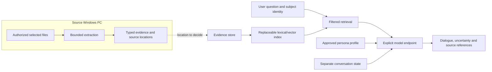

# Soulkiller feasibility study

**Research snapshot:** 2026-10-02. **Status:** reviewed and merged in
[PR #4](https://github.com/Eneru/soulkiller/pull/4) on 2026-10-03.
**Tracking:** [issue #3](https://github.com/Eneru/soulkiller/issues/3);
OpenSpec change [analyze-soulkiller-feasibility](../../openspec/changes/analyze-soulkiller-feasibility/proposal.md).
Read with the [approved brief](soulkiller-feasibility-study.md),
[evaluation proposal](soulkiller-evaluation-plan.md) and
[decision register](soulkiller-decisions.md).

## Recommendation for review

Start with a small, provenance-preserving local corpus and grounded persona
prompting. Use lexical retrieval as the reference, then compare semantic/hybrid
retrieval against it. This is a proposed RAG-first path: facts remain inspectable,
while speaking style and conversation memory are separate concerns.

Python is the preferred extraction experiment because it exposes the shortlisted
document/ML tools directly. C#/.NET is the alternative if native Windows delivery
and application integration dominate. Begin with one principal application
language and an explicit inference interface. No stack is adopted here.

Windows on an ordinary household PC is the confirmed source-machine priority.
The study assumes no dedicated GPU for its baseline; exact CPU/RAM requirements
still need approval and measurements. A local collector does not imply that a
satisfactory conversational model can run on every such PC.

Evaluate full and parameter-efficient fine-tuning as conditional later options
for a demonstrated behavior/style gap. Do not use training as the first method
for importing changing personal facts. Evaluate OmniRoute only when multiple
endpoints or fallback justify a gateway and its data flows have been reviewed.

## Evidence and scope

- **Documented:** a primary source describes the capability or limitation.
- **Hypothesis:** an engineering recommendation requiring project evaluation.
- **Unknown:** requirements or measurements are missing.
- **Measured:** reserved for executed Soulkiller experiments; this study has none.

The study compares documented capabilities and proposes experiments. No candidate
dependency was installed, model downloaded, personal file processed or provider
called. Published benchmarks are not predictions for the user's PC.
All primary links below were consulted on 2026-10-02. Live documentation can move;
a reviewed release/card is not an installed or selected dependency version.

Confirmed: local authorized extraction, text/PDF/image/video inputs, technology
comparisons, maintainer choices and Windows-first household-PC deployment.
At the research snapshot, corpus/languages, offline/data egress and memory were
unanswered. The maintainer's 2026-10-03 answers now confirm TXT/PDF text,
French/English, an approximately 1,000-page planning corpus and automatic,
inspectable/deletable memories used immediately, with conversational origin
preserved and shared within the same persona. Local versus remote remains to compare.
The [decision register](soulkiller-decisions.md) and
[framing document](soulkiller-first-increment-framing.md) record current answers
and remaining hardware, memory, data-boundary, journey and resource choices.
These answers do not turn the unexecuted study into runtime evidence.

## W2: extraction alternatives

The benefits and costs in this matrix are engineering assessments based on the
cited capabilities. Quality, RAM, throughput and Windows bundles are unmeasured.

| Candidate / role | Documented capability and terms | Conditional advantage | Limitation or added cost |
| --- | --- | --- | --- |
| Standard text readers | Decode selected TXT/Markdown with offsets; no model needed | Small baseline for plain text | Unknown encodings, attribution and normalization still need rules |
| pypdf | PDF text/metadata, including layout mode; BSD-3-Clause | Pure-Python route for born-digital PDFs | No OCR; PDF content streams can use substantial memory; scans need another route |
| Docling | Structured PDF/document conversion, layout, tables, OCR and local execution; MIT code, separate model terms | Common representation when structure matters | More assets/dependencies; installation and local resource use need measurement |
| Apache Tika | Broad document/media text and metadata parsing; Apache-2.0 with dependency notices | Broad formats if Office/email/archive support becomes essential | Java runtime; metadata is not OCR or visual understanding |
| PyMuPDF | Text, geometry, rendering and optional Tesseract OCR | Useful combined extraction/rendering candidate | Native components and AGPL/commercial terms require a distribution decision |
| Tesseract | Printed-text OCR and structured output; Apache-2.0 engine/data candidates | CPU baseline for scans and screenshots | Rendering, segmentation and language data required; handwriting is a separate problem |
| RapidOCR / PaddleOCR | Neural text detection/recognition; Apache-2.0 code with model/runtime inventories | Challenger for OCR quality and deployment | Actual model/language combination and packaged inference engine need checking |
| FFmpeg | Audio/frame decoding and sampling; build-dependent codec coverage | Reusable native subprocess across languages | Licensing varies with build options; sampling can miss events |
| Whisper / faster-whisper | ASR; faster-whisper adds CTranslate2 execution, timestamps/VAD and quantized CPU options | Compare speech quality and CPU cost on the same model/settings | Transcription can hallucinate; neither supplies speaker identity or complete video meaning |

Primary evidence: [pypdf extraction](https://pypdf.readthedocs.io/en/stable/user/extract-text.html),
[pypdf license](https://github.com/py-pdf/pypdf/blob/main/LICENSE),
[Docling](https://github.com/docling-project/docling),
[Tika formats](https://tika.apache.org/docs/4.1.x/formats.html),
[Tika release/runtime](https://tika.apache.org/),
[PyMuPDF licensing](https://pymupdf.readthedocs.io/en/latest/about.html#license-and-copyright),
[PyMuPDF OCR](https://pymupdf.readthedocs.io/en/latest/recipes-ocr.html),
[Tesseract](https://github.com/tesseract-ocr/tesseract),
[RapidOCR](https://github.com/RapidAI/RapidOCR),
[PaddleOCR](https://github.com/PaddlePaddle/PaddleOCR),
[FFmpeg licensing](https://ffmpeg.org/legal.html),
[Whisper](https://github.com/openai/whisper),
[faster-whisper](https://github.com/SYSTRAN/faster-whisper).

### Per-format shortlist

**Text/PDF:** compare standard readers plus pypdf against Docling on the same
synthetic pages. Escalate pages needing OCR explicitly instead of calling empty
text a successful import. Use Tika if broader formats justify Java; consider
PyMuPDF only after licensing review. These alternatives need not all be shipped.

**Scans/images:** compare Tesseract with RapidOCR through an interchangeable OCR
contract. Store text and geometry. Handwriting needs its own corpus: Tesseract
documents poor suitability, while TrOCR's handwriting checkpoint targets
single-line images and would need page segmentation. Do not promise notebook
ingestion from that checkpoint alone.
[Tesseract FAQ](https://tesseract-ocr.github.io/tessdoc/FAQ.html#can-i-use-tesseract-for-handwriting-recognition),
[TrOCR card](https://huggingface.co/microsoft/trocr-base-handwritten).

**Pictures:** OCR, file metadata and model-generated descriptions are distinct
evidence types. SmolVLM-256M-Instruct is a small experimental description candidate;
Granite Vision 3.1 2B preview is a larger comparator. Their cards declare
Apache-2.0 and English support; suitability for personal photographs and CPU
operation remains unknown.
[SmolVLM card](https://huggingface.co/HuggingFaceTB/SmolVLM-256M-Instruct),
[Granite Vision card](https://huggingface.co/ibm-granite/granite-vision-3.1-2b-preview).

**Video:** compare a modular route (probe, audio/transcript, timestamped frames,
OCR/optional descriptions) with Docling's documented audio/video pipeline.
Fixed-interval sampling is budgetable; scene-change sampling can reduce
duplicates. Neither guarantees all visual events. Test original-time mapping,
variable frame rates, rotation and silent clips. Diarization is optional and
does not establish a real person's identity.
[FFmpeg scene detection](https://ffmpeg.org/ffmpeg-filters.html#scdet),
[Docling media processing](https://docling-project.github.io/docling/usage/processing_audio_media/).
Whisper's documented false/repetitive text and language variation justify
silence, music and noisy-speech tests.
[Whisper model card](https://github.com/openai/whisper/blob/main/model-card.md).

Local execution requires provisioned assets: Docling documents prefetching and
resource limits; faster-whisper can load a local model directory. Test cold-start
with networking unavailable, not only a warmed cache.
[Docling advanced options](https://docling-project.github.io/docling/usage/advanced_options/),
[faster-whisper loading](https://github.com/SYSTRAN/faster-whisper).

### Proposed extraction and evidence contract

These are requirements to propose in a later behavior specification:

- Explicit file selection, progress, cancellation, per-file errors and bounded
  work: pages, duration, pixels, decoded bytes, concurrency and timeout.
- Source/subject IDs, content hash, source revision, author when known, event date
  distinct from import date, extractor/model/configuration identity.
- Original quotations, OCR/transcript output and inferred summaries/descriptions
  carry different types and review status.
- Source locations retain page/region, text offset or original media time range.
- Stable checkpoints resume verified units; changed source/model/configuration
  invalidates affected results. A partial job remains visibly partial.
- Outcomes distinguish unsupported, encrypted, corrupt, needs-OCR, partial,
  cancelled, timeout and resource-limit cases.

A file's presence on a person's PC does not prove authorship or personal belief.
Docling's structured representation provides provenance primitives, but complete
application-level resumability and attribution remain Soulkiller work.
[DoclingDocument](https://docling-project.github.io/docling/concepts/docling_document/).

## W3: evidence lifecycle and retrieval

Propose a durable evidence store separate from replaceable indexes. Chunk by
document structure and bounded size, preserving IDs and citations; test questions
crossing chunk boundaries. Source changes replace affected passages/index entries
as a visible revision. Deletion must specify caches, summaries, chat references
and backups as well as retrieval results.

| Candidate | Documented capability | Conditional advantage | Cost / uncertainty |
| --- | --- | --- | --- |
| SQLite FTS5 | Phrase/prefix/proximity search and BM25 | Embedded lexical reference for names, dates and exact phrases | Semantic paraphrase and language handling need comparison |
| PostgreSQL + pgvector | Exact vector search; optional HNSW/IVFFlat; relational and full-text integration | Reuse a database if shared application data already needs PostgreSQL | Service/extension operations; approximate filtering can lose candidates |
| Qdrant | Payload filters, point lifecycle and dense/sparse hybrid queries | Dedicated retrieval features when justified | Extra service and evidence/index synchronization |
| FAISS, conditional | Exact and approximate vector indexes | Embedded dense-search reference | Metadata/lifecycle isolation stays in application code; deletion differs by index |

Evidence: [SQLite FTS5](https://www.sqlite.org/fts5.html),
[pgvector](https://github.com/pgvector/pgvector),
[Qdrant points](https://qdrant.tech/documentation/manage-data/points/),
[Qdrant hybrid queries](https://qdrant.tech/documentation/search/hybrid-queries/),
[FAISS index guide](https://github.com/facebookresearch/faiss/wiki/Guidelines-to-choose-an-index).

**Hypothesis:** benchmark lexical first, dense/hybrid second, reranking only if
quality gains justify latency. Prefer pgvector if PostgreSQL becomes a requirement;
consider Qdrant if its dedicated query/filter features justify another service.
No vector database is required merely to begin testing the persona.

Enforce subject identity outside the model. Tenant filters require reliable
application enforcement; database row policies also require correct access roles.
[Qdrant multitenancy](https://qdrant.tech/documentation/manage-data/multitenancy/),
[PostgreSQL row security](https://www.postgresql.org/docs/17/ddl-rowsecurity.html).
Removal from query results is different from physical erasure. FTS5 documents
separate secure-deletion controls; backups and other stores still need policies.
[SQLite deletion](https://www.sqlite.org/fts5.html#the_secure_delete_configuration_option).

### Embeddings and composition

E5-small is a small multilingual candidate: its card specifies 384 dimensions,
512-token truncation and query/passage prefixes, including non-English text.
BGE-M3 is a larger comparator with 1024 dimensions, up to 8192 tokens and
dense/sparse/multi-vector modes. Both cards declare MIT. Actual model revisions,
download size, Windows runtime and CPU/RAM performance must be measured.
[E5-small card](https://huggingface.co/intfloat/multilingual-e5-small/raw/main/README.md),
[BGE-M3 card](https://huggingface.co/BAAI/bge-m3).

Cross-encoder reranking adds query-passage work after retrieval; it cannot repair
missing candidates. BGE-reranker-v2-m3 is a multilingual Apache-2.0 candidate.
Scores are not probabilities that a biographical claim is true.
[Retrieve/rerank](https://sbert.net/examples/sentence_transformer/applications/retrieve_rerank/README.html),
[reranker card](https://huggingface.co/BAAI/bge-reranker-v2-m3).

| Composition option | Documented focus | Engineering tradeoff |
| --- | --- | --- |
| Explicit adapters/pipeline | Project-owned extraction, retrieval and inference contracts | Clear baseline and few dependencies; own lifecycle/error handling |
| LlamaIndex | Ingestion, indexes, query engines and evaluation modules | RAG-oriented reuse; abstraction and defaults still need inspection |
| LangChain | Model/tool integrations and orchestration | Broad integrations; unnecessary agent machinery could complicate a small flow |
| Semantic Kernel | Model integration and orchestration SDK | Candidate with .NET; still need concrete extraction/retrieval components |

Sources: [LlamaIndex](https://developers.llamaindex.ai/python/framework/),
[LangChain](https://docs.langchain.com/oss/python/langchain/overview),
[Semantic Kernel](https://learn.microsoft.com/en-us/semantic-kernel/overview/).
Start the experiment with an explicit pipeline; introduce a framework only for
an identified integration benefit. Inspect defaults before any network use.

## W4: facts, persona and memory

| Layer | Proposed responsibility | Failure to evaluate |
| --- | --- | --- |
| Evidence | Attributed passages supporting personal facts | Fabrication, stale facts, incorrect author/subject and unresolved conflict |
| Persona profile | Approved tone, vocabulary and attributed style examples | Mistaking imitation for evidence of a remembered event |
| Conversation state | Current dialogue; optional separately approved durable memories | Generated answers silently becoming historical evidence |

The maintainer must choose a fixed snapshot versus an evolving simulation.
If memory persists, record who said what, when, for which conversation/subject,
and whether it has been accepted as a memory. Do not silently promote a chat
participant's statement or an assistant answer into source evidence.

First-person dialogue can combine style with source-grounded answers, but unknown
feelings/events and contradictory statements require an agreed response policy.
Citations could be visible alongside immersive dialogue. Voice/avatar work and
identity fidelity are additional questions, not implied by text-based persona
feasibility.

| Approach | Appropriate experiment | Advantages | Drawbacks |
| --- | --- | --- | --- |
| Grounded prompt with selected passages | Establish answer/style behavior | No training; inspectable input | Manual selection or context limits; inference still costs resources |
| RAG | Evolving source-grounded facts | Replace evidence/indexes without retraining; inspectable citations | Retrieval errors, lifecycle work and generation hallucinations remain |
| Full fine-tuning | Demonstrated behavior/style gap | Can change learned behavior | Training data/compute/checkpoints; not inherently a citation or deletion system |
| LoRA / QLoRA | Later style/output-contract adaptation | Reduces trainable state, with a compatible base model | Still needs data/tooling/training/regressions; not a guarantee for household PCs |

The RAG paper motivates external memory and provenance; a project need not
replicate its training setup to compare pretrained retrieval and prompting.
LoRA freezes base weights and trains low-rank updates; QLoRA reduces memory
using a quantized base. Their experimental hardware/results do not establish
Soulkiller feasibility on an unspecified PC.
[RAG v4](https://arxiv.org/abs/2005.11401v4),
[LoRA v2](https://arxiv.org/abs/2106.09685v2),
[QLoRA v1](https://arxiv.org/abs/2305.14314v1).

**Hypothesis:** RAG plus an approved persona prompt is the first candidate;
PEFT is conditional on a measured style gap. Adapters remain tied to a compatible
base model. Retraining without a source is not itself proof that an older model
artifact has forgotten that source.
[PEFT LoRA](https://huggingface.co/docs/peft/main/en/conceptual_guides/lora).

Imported instructions are untrusted evidence. Neither RAG nor fine-tuning
eliminates prompt injection; evaluate boundary failures without granting the
model collection or filesystem authority.
[OWASP prompt injection](https://genai.owasp.org/llmrisk/llm01-prompt-injection/).

## W5: languages and native Windows delivery

| Option | Documented building blocks | Engineering advantage | Drawback / condition |
| --- | --- | --- | --- |
| Python | Docling/pypdf/OCR/ASR and ML bindings | Fastest route to the shortlisted extraction experiment | Native libraries, subprocesses and model assets complicate a bundle |
| C#/.NET | PdfPig PDF extraction; ONNX Runtime C#; self-contained publishing | Typed Windows application and deployment alternative | Match OCR/ASR/layout quality through wrappers/tools; not all models are interchangeable |
| TypeScript/Node | PDF.js; Transformers.js tasks/ONNX-based inference | Candidate when web/desktop UI is central | Browser access differs from a native collector; model/native-addon coverage needs checking |
| Small mixed stack | Typed subprocess or HTTP contracts | Reuse the best extractor/inference process | Two runtime lifecycles, packaging and schema/error contracts |

Primary evidence: [PdfPig](https://github.com/UglyToad/PdfPig),
[ONNX Runtime C#](https://onnxruntime.ai/docs/get-started/with-csharp.html),
[.NET publishing](https://learn.microsoft.com/en-us/dotnet/core/deploying/),
[PDF.js](https://github.com/mozilla/pdf.js),
[Transformers.js](https://github.com/huggingface/transformers.js).
Library availability supports the comparison; productivity/throughput rankings
are unmeasured. Native OCR/inference cost is not predicted by the host language.

PyInstaller is not a cross-compiler: a Linux devcontainer build cannot establish
a working Windows executable. .NET self-contained/single-file deployments target
an OS/architecture, retain native dependencies and need republishing for bundled
runtime fixes. AOT adds compatibility restrictions and is not required initially.
[PyInstaller](https://pyinstaller.org/en/stable/),
[PyInstaller bundle licensing](https://pyinstaller.org/en/stable/license.html),
[.NET Native AOT](https://learn.microsoft.com/en-us/dotnet/core/deploying/native-aot/).

Node 24 SEA documentation describes bundled CommonJS entry code, special
native-addon handling and an evolving packaging feature. Do not assume features
from a newer Node major exist in Soulkiller's pinned environment.
[Node 24 SEA](https://nodejs.org/docs/latest-v24.x/api/single-executable-applications.html).

**Hypothesis:** begin with an explicitly launched CLI or a small file-selection
interface, progress/cancellation and evidence inspection. A persistent Windows
service, Angular or an Electron shell must earn its additional footprint.
Avalonia and Electron are desktop candidates; their platform/runtime/security
maintenance belongs in a later UI decision.
[Avalonia platforms](https://docs.avaloniaui.net/docs/supported-platforms),
[Electron security](https://www.electronjs.org/docs/latest/tutorial/security).

## Candidate data flow and deployment choices

The diagram is a proposed separation of responsibilities, not adopted stages.
Only extraction on the source machine is confirmed; the dashed route needs a
decision on where evidence and inference may run.

| Placement option | Advantage hypothesis | Cost / open question |
| --- | --- | --- |
| All local, provisioned offline assets | Small data-egress boundary and no provider charge | On-PC RAM/latency/model quality; downloads and update distribution |
| Local collection/retrieval, inference on another owned machine | Keep collector light while separating compute | Authentication, transport, availability and which excerpts may cross |
| Local collection/retrieval, explicit hosted inference | Avoid large local generation workload | External processing, credentials, recurring cost and network dependence |
| Local extraction, remote evidence/index/inference | Shared compute/storage possibility | Broadest data transfer and retention boundary; explicit approval required |

No remote placement is authorized by the mere existence of this comparison.

| Inference choice | Documented behavior | Tradeoff |
| --- | --- | --- |
| llama.cpp | Native CPU/quantized inference, supported GPU backends and server APIs | Explicit binary/model/process control; more lifecycle work |
| Ollama | Native Windows distribution and local API/model management | Convenient experiment; background process and optional cloud features need configuration |
| Direct hosted adapter | Explicit selected endpoint/data exchange | Fewer local compute demands; provider/model and budget remain unselected |

[llama.cpp](https://github.com/ggml-org/llama.cpp),
[llama.cpp server](https://github.com/ggml-org/llama.cpp/blob/master/tools/server/README.md),
[Ollama Windows](https://docs.ollama.com/windows),
[Ollama FAQ](https://docs.ollama.com/faq).
Ollama documents `OLLAMA_NO_CLOUD=1` for local-only use. Loopback binding is
different from preventing all outbound traffic. Both runtimes are MIT; model
weights/tokenizers have separate distribution terms.
[llama.cpp license](https://github.com/ggml-org/llama.cpp/blob/master/LICENSE),
[Ollama license](https://github.com/ollama/ollama/blob/main/LICENSE).

### Resources and costs: explicit bounds, not forecasts

Hypothetical 4-bit raw weights use `parameter_count × 4 / 8` bytes:
1B-3B parameters imply about 0.5-1.5 GB; 7B implies 3.5 GB.
These are arithmetic lower bounds, excluding quantization metadata, runtime,
KV cache/context, OS and concurrent extraction. They are not actual download
sizes or RAM requirements. Small quantized-model experiments still need language,
persona fidelity and Windows CPU measurements.

For a hypothetical 10,000 passages, float32 vectors alone use
`count × dimensions × 4`: about 14.65 MiB at 384 dimensions or 39.06 MiB at 1024.
Index/metadata/model/runtime memory and raw media are additional.
The model cards above supply the dimension examples; this is not a corpus
size commitment.

Estimate media work as `media_duration × measured_processing_ratio`, and frame
work from the approved sampling rate. Measure p50/p95 and peak memory with
sequential jobs before increasing parallelism on household PCs.
Provider inference cost is
`input_tokens × input_rate + output_tokens × output_rate`, with retries,
embedding calls and any gateway charges added. No selected provider or rate
means no credible currency quote yet. Local provider charges may be zero;
hardware, storage, power, packaging and time remain costs.

## OmniRoute: optional routing candidate

The requested repository was reviewed at `release/v3.8.50`; its package metadata
declares version 3.8.50 and points to `diegosouzapw/OmniRoute`. The source/artifact
provenance needs review before installation, without assuming that the difference
is a defect. Code is MIT; third-party notices and endpoint/model terms are separate.
[Package metadata](https://raw.githubusercontent.com/NStambovsky/OmniRoute/release/v3.8.50/package.json),
[license](https://github.com/NStambovsky/OmniRoute/blob/release/v3.8.50/LICENSE),
[notices](https://github.com/NStambovsky/OmniRoute/blob/release/v3.8.50/THIRD_PARTY_NOTICES.md).

Its documented API/routing/fallback can centralize multiple providers, but adds
a service and prompt/credential state. The README also describes external
zero-credential backends. `auto/offline` concerns provider quota selection, not
disconnected local inference.
[OmniRoute README](https://github.com/NStambovsky/OmniRoute),
[auto-combo guide](https://github.com/NStambovsky/OmniRoute/blob/release/v3.8.50/docs/routing/AUTO-COMBO.md).

Security documentation describes plaintext secret storage without
`STORAGE_ENCRYPTION_KEY`, configurable logging and best-effort fail-open
guardrails. These require explicit configuration and tests; the gateway cannot
be treated as the enforcement boundary for source consent or isolation.
[Security documentation](https://github.com/NStambovsky/OmniRoute/blob/release/v3.8.50/SECURITY.md).

| Criterion | Direct adapter | OmniRoute |
| --- | --- | --- |
| Data path | One explicit endpoint | Gateway and eligible downstream/fallback endpoints |
| Operation | Fewer processes | Central routing plus state/configuration |
| Failure policy | Application defines bounded retries/refusal | Routing rules must preserve the allowed data boundary |
| Observation | Application metadata/log policy | Gateway logs/caches/retention also need inspection |
| Recommendation | First single-endpoint baseline | Later opt-in experiment if routing benefit is demonstrated |

Before an experiment: review source/artifact identity, pin a release, restrict
eligible endpoints, prohibit unauthorized fallback, configure storage/logging,
test explicit start/stop and compare API/streaming/error behavior. Evaluate any
compression against exact names, dates and citations. No service starts in this
study.

## Candidate code-license inventory

These declarations cover the named code repositories, consulted on 2026-10-02,
not all integrations, build tools, bundled native libraries, datasets, services
or model weights. Recheck the exact release/artifact and notices before adoption.

| Candidate | Declared code terms / scope |
| --- | --- |
| SQLite / FTS5 | [Public-domain dedication](https://www.sqlite.org/copyright.html) for deliverable library code; build scripts can differ |
| pgvector | [PostgreSQL License](https://github.com/pgvector/pgvector/blob/master/LICENSE) |
| Qdrant server | [Apache-2.0](https://github.com/qdrant/qdrant/blob/master/LICENSE) |
| FAISS | [MIT](https://github.com/facebookresearch/faiss/blob/main/LICENSE) |
| LlamaIndex Python / LangChain Python / Semantic Kernel | MIT: [LlamaIndex](https://github.com/run-llama/llama_index/blob/main/LICENSE), [LangChain](https://github.com/langchain-ai/langchain/blob/master/LICENSE), [Semantic Kernel](https://github.com/microsoft/semantic-kernel/blob/main/LICENSE) |
| PdfPig | [Apache-2.0 with external-component notices](https://raw.githubusercontent.com/UglyToad/PdfPig/master/LICENSE) |
| ONNX Runtime | [MIT](https://github.com/microsoft/onnxruntime/blob/main/LICENSE) |
| PDF.js / Transformers.js | Apache-2.0: [PDF.js](https://github.com/mozilla/pdf.js/blob/master/LICENSE), [Transformers.js](https://github.com/huggingface/transformers.js/blob/main/LICENSE) |
| Electron / Avalonia core | MIT: [Electron](https://raw.githubusercontent.com/electron/electron/main/LICENSE), [Avalonia](https://raw.githubusercontent.com/AvaloniaUI/Avalonia/master/licence.md); bundled components/extensions have separate terms |
| PyInstaller | [GPL-2.0 with bundling exception and certain Apache-2.0 files](https://pyinstaller.org/en/stable/license.html); application dependencies retain their terms |

Other extraction/runtime/model terms are recorded beside their candidates above.
No compatibility conclusion for Soulkiller's distribution is implied.

## Reviewed source snapshots

These identify what the desk research inspected, not installed dependencies.

| Source family | Snapshot / observed documentation |
| --- | --- |
| Docling | [2.132.0 release](https://github.com/docling-project/docling/releases/tag/v2.132.0) and live docs |
| Tika | 4.1.x documentation and 4.1.0 announcement; Java 17 |
| pypdf / PyMuPDF | Documentation observed as 6.19.0 / 1.28.2; exact experiment versions still to pin |
| Tesseract / RapidOCR | [5.5.3 release](https://github.com/tesseract-ocr/tesseract/releases/tag/5.5.3) / [3.9.2 release](https://github.com/RapidAI/RapidOCR/releases/tag/v3.9.2) |
| FFmpeg / faster-whisper | Release/download documentation observed as 8.1.3 / [1.2.1](https://github.com/SYSTRAN/faster-whisper/releases/tag/v1.2.1); distributed build still to select |
| SQLite / pgvector / Qdrant / frameworks / inference runtimes | Live documentation; no tested version. pgvector search cache/live patch versions differed |
| Embedding, OCR and vision models | Named model cards; exact weight revision/hash not pinned |
| RAG / LoRA / QLoRA | Versioned papers linked above |
| PyInstaller / .NET / Node | Live packaging docs; Node 24 line inspected, no Windows bundle built |
| OmniRoute | Requested repository branch release/v3.8.50 metadata/docs |

Every benchmark must replace moving identifiers with explicit artifact/model
versions and licenses. This desk study supports candidate selection for that
benchmark; it does not establish runtime compatibility.

## W6: next decisions and experiments

The [evaluation proposal](soulkiller-evaluation-plan.md) defines a synthetic
corpus, metrics, failure cases and future execution records.
The [decision register](soulkiller-decisions.md) presents choices and follow-ups.

Proposed first increment for review: explicitly import TXT and born-digital PDF,
inspect attributed passages, query one synthetic persona with lexical retrieval,
then compare one approved model through an explicit endpoint. Add OCR, semantic
retrieval, images and video according to priority and measured benefit.
This is a candidate slice, not a definition of Soulkiller's product stages.

Approve the hardware/corpus profile, permitted data boundary and persona/memory
behavior before implementation. Native Windows packaging and all performance,
quality, cost and offline claims remain unverified.
